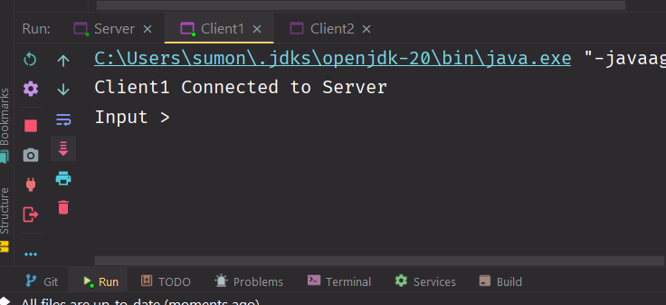

## 😀 Socket Based Messaging

### 😵 Assignment Tasks : 

- Create multiple client so that the clients can interact with the server. (hint: use Thread Pool).
- Configure the server so that the clients can talk to each other.
- Resources
  - Socket Programming Demo [👉 Git Link](https://github.com/CosmicBeing09/Socket-Programming-Demo/tree/main)
  - Java Thread Pool [👉 Click Here](https://github.com/CosmicBeing09/Socket-Programming-Demo/tree/main)

### 😏 Preview Socket Based Messaging ( Client to Client Communication)

- **Step - 1 : Run "Server.js"**

- **Step - 2 : Run "Client1.js"**

Client1 Connected with Server

- **Step - 3 : Run "Client2.js"**
    
    
Client2 Connected with Server

- **Step - 4 : Write a message in "Client1.js"**

Client1 message sent to Server and Server received the message

Server send the message to client2 and client2 received the message

#### 🛫 Summary : Client1 -> Server -> Client2

- **Step - 5 : Write a message in "Client2.js"**

Client2 message sent to Server and Server received the message

Server send the message to client1 and client1 received the message

#### 🛫 Summary : Client2 -> Server -> Client1

## Like Client1 and Client2 can communicate with each other (Middleman : Server)